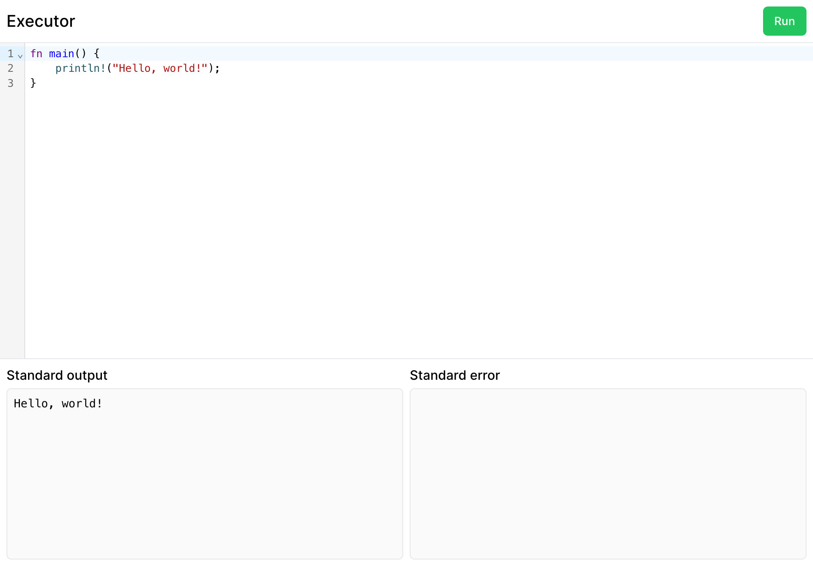

# Executor

Executor is a code playground that runs code from the browser, similar to [Go Playground](https://go.dev/play/) and [Rust Playground](https://play.rust-lang.org/). It compiles and runs submitted code and returns the output. Under the hood, Executor uses [Nomad](https://www.nomadproject.io/) to run the code in a Docker container.

  <a href="https://executor.dmo.ooo/">
    
     
    <strong>executor.dmo.ooo</strong>
  </a>

